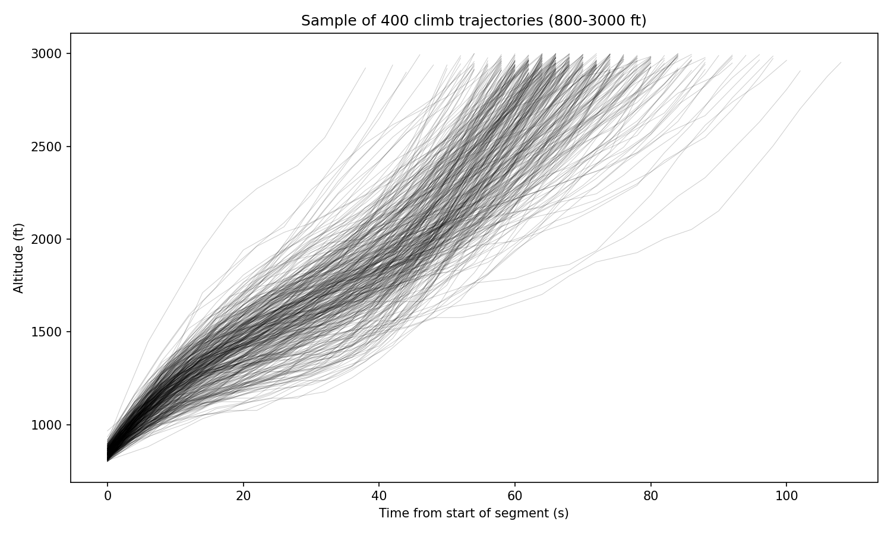
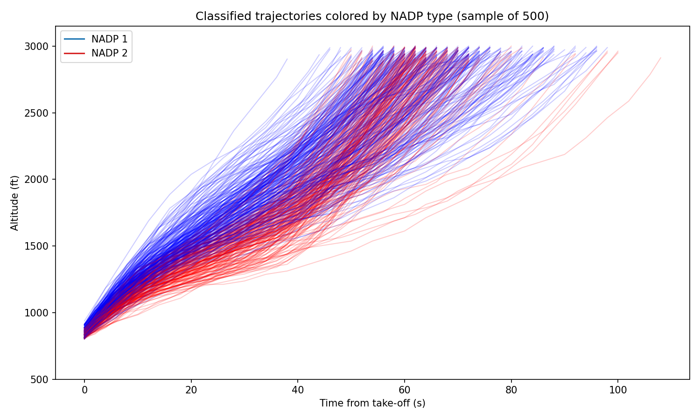
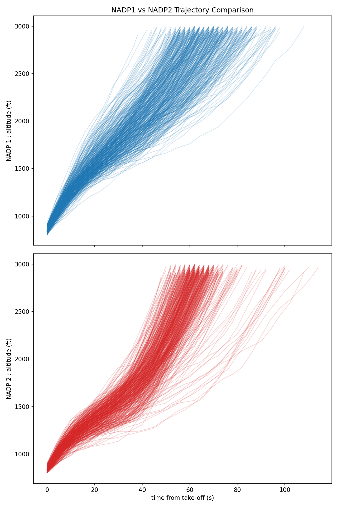

# NADP Profile Identification from Trajectory Data

**Author:** Junzi Sun

**Objective**

The repository aims at identify Noise Abatement Departure Procedure (NADP) profiles (NADP 1 vs NADP 2) from aircraft departure trajectory data. This part of the report describes background, data, methods (detailed), results, limitations and recommended next steps.

**Repository files referenced**

- `1_clean_files.sh` — preprocesses raw CSV data, removing malformed rows and null markers.
- `2_combine_months.py` — combines cleaned monthly CSV files and splits by flight type (correcting inverted labels).
- `3_extract_nadp_segments.py` — loads departure trajectories and extracts NADP climb segments.
- `4_nadp_matching.py` — performs clustering-based classification and assigns NADP types to flights.

**Background**

- **NADP (Noise Abatement Departure Procedures)**
  - NADP 1 and NADP 2 are two example climb procedures intended to reduce noise exposure at different distances from the runway. NADP 1 (close-in) retains take-off configuration longer and delays flap/slat retraction until higher altitude (e.g., 900 m / 3000 ft), producing a steeper initial climb and later acceleration. NADP 2 (distant) initiates flap/slat retraction and acceleration earlier (e.g., from 240 m / 800 ft), producing a shallower, faster climb profile. 

- **`traffic` library**
  - The code uses the `traffic` Python library to represent flights as Flight objects and collections as Traffic. The library provides methods for loading Parquet files, computing flight phases, calculating derived parameters (cumulative distance, vertical rate, groundspeed), selecting time segments, and resampling trajectories. These utilities enable efficient processing and alignment of trajectory data for analysis.

- **Clustering basics**
  - The implementation uses KMeans clustering with 2 clusters. KMeans partitions observations by minimizing within-cluster distances to cluster centroids, assuming numeric vectors of equal length. Since clustering is unsupervised, the resulting cluster labels must be mapped to NADP semantics (NADP1/NADP2) using domain heuristics.

**Data**

Note: you must create the `data` folder. The original data should be placed under `data/raw/`. 

You also need to run the scripts from 1 - 4 to generation the intermediate and final results, inlduing:

- Raw input: `data/raw/*.csv` — monthly CSV files containing flight trajectory data with columns: flight_id, timestamp, latitude, longitude, track, altitude, callsign, registration, typecode, flag.
- Preprocessed input: `data/departure_trajectories.parquet` — produced by cleaning, combining, and splitting the raw CSVs.
- Intermediate: `data/nadp_trajectories.parquet` — extracted and resampled climb segments between 30–5000 ft, filtered for short climbs (<3 min) and resampled to 2-second intervals.
- Output: `data/flight_id_nadp.csv` — mapping flight IDs to NADP types (nadp1/nadp2).

**Method Summary**

1. Clean and preprocess raw CSV data, combine monthly files, and separate by flight type.
2. Extract NADP climb segments from departure trajectories and resample to fixed intervals.
3. Select the significant climb phase (800–3000 ft), compute time-from-takeoff, produce equal-length altitude vectors per flight.
4. Cluster altitude vectors with KMeans (k=2).
5. Map cluster ids to NADP 1 / NADP 2 using a vertical-rate based heuristic and export results.

**Results**

The clustering-based classification was applied to 93,216 departure flights from the NADP trajectories dataset. All flights had valid climb segments within the significant phase (800–3000 ft) and were successfully vectorized for clustering.

*Processing statistics:*
- Total flights loaded: 93,216
- Flights with valid significant phase (800–3000 ft): 93,216 (100%)
- Design matrix shape: 93,216 flights × 100 features (resampled altitude points)

*Clustering results:*
- KMeans successfully partitioned flights into 2 clusters
- Cluster 0: 41,506 flights
- Cluster 1: 51,710 flights

*NADP classification:*
- Based on the vertical-rate heuristic (mean vertical rate below 2500 ft):
  - Cluster 1 → NADP1: 1790.7 ft/min (higher vertical rate, steeper climb)
  - Cluster 0 → NADP2: 1718.7 ft/min (lower vertical rate, shallower climb)
- Final distribution:
  - **NADP1: 51,710 flights (55.5%)**
  - **NADP2: 41,506 flights (44.5%)**

*Validation:*
- The ~72 ft/min difference in mean vertical rates confirms the clustering captures meaningful climb profile differences
- Visual inspection of trajectory plots (see below section) shows clear separation: NADP1 trajectories exhibit steeper initial climbs compared to NADP2
- Sample trajectory visualizations demonstrate the expected geometric differences between the two procedure types

**Trajectory Visualizations**

Below are key figures generated during the analysis, located in the `plots/` directory:

| Figure | Description |
|--------|-------------|
|  | 400 sample trajectories showing altitude vs time-from-takeoff during the significant climb phase. |
|  | 500 trajectories colored by NADP classification (blue: NADP1, red: NADP2). |
|  | Side-by-side comparison of NADP1 (top) and NADP2 (bottom) climb profiles. |

These visualizations illustrate the separation between NADP1 and NADP2 climb procedures and validate the clustering-based classification.

**Detailed and Reproducible Steps**

The following describes the exact transformations and algorithmic steps implemented in the repository:

1) Data cleaning and combination
   - Clean raw CSV files:
     - Remove rows with malformed numerical fields (commas within quoted values).
     - Replace null value markers with empty strings.
     - Save cleaned files to the `data/cleaned/` directory.
   - Combine monthly files:
     - Read all cleaned CSV files and concatenate them into a single DataFrame.
     - Define consistent column data types for all trajectory fields (flight_id, timestamp, coordinates, altitude, aircraft metadata).
     - Parse timestamps and enforce type consistency across all monthly data.
     - Add an icao24 column (copied from callsign) for compatibility with the traffic library.
     - Split by flight flag and save to Parquet files:
       - Note: Original labels "Departure" and "Arrival" are inverted in the CSV data and must be swapped.
       - Flights marked as "Departure" in raw data are saved as arrivals.
       - Flights marked as "Arrival" in raw data are saved as departures.
   
   Implementation notes & caveats:
   - The cleaning step removes malformed rows but does not validate or impute missing coordinates or altitudes. Downstream processing should handle sparse or noisy data.
   - Label inversion (Departure/Arrival) is corrected during this step; users must be aware of this swap when interpreting the raw data.

2) NADP segment extraction
   - Load departure trajectories from preprocessed Parquet file into a Traffic collection.
   - For each flight:
     - Drop unnecessary columns and compute derived parameters:
       - Calculate cumulative distance traveled.
       - Compute groundspeed and track angle.
       - Calculate vertical rate (feet per minute) using finite differences on altitude over time.
     - Identify flight phases and extract climb phase timestamps.
     - Select the climb segment between 30 and 5000 ft altitude.
     - Filter to keep only short climb segments (under 3 minutes duration) to exclude holding patterns and anomalous tracks.
     - Resample the segment to a regular 2-second time grid.
   - Save the collection of processed NADP segments to Parquet.

   Implementation notes & caveats:
   - The altitude bounds (30–5000 ft) and 3-minute duration limit are heuristics chosen to isolate the departure climb.
   - Resampling to 2-second intervals provides a regular time grid but may introduce interpolation artifacts if original data is sparse or noisy.

3) Significant-phase extraction & vectorization
   - Load the NADP trajectory segments from Parquet.
   - For each flight, extract the subset between 800 and 3000 ft altitude to focus on the altitude band where NADP differences are most evident.
   - Add a time-from-start column representing seconds elapsed from the beginning of this segment.
   - Resample each flight to a fixed number of samples (100 points) to create equal-length vectors.
   - Build a design matrix where each row represents one flight and contains the altitude profile as a flattened vector.
   - Processing uses parallel execution with 24 workers to handle the large dataset efficiently.

   Implementation notes:
   - Using altitude alone focuses clustering on geometric climb shape (steep vs shallow). Combining altitude with vertical rate or speed would capture acceleration behavior more explicitly.
   - The resampling step assumes flights produce vectors of consistent length; missing samples could cause issues.

4) Clustering (KMeans) and mapping to NADP types
   - Apply KMeans clustering with 2 clusters to the design matrix, partitioning flights into two groups based on altitude profile similarity.
   - Merge cluster labels back to flight metadata.
   - Determine which cluster corresponds to NADP1 vs NADP2 using a vertical-rate heuristic:
     - Compute mean vertical rate below 2500 ft for each cluster.
     - Map the cluster with higher mean vertical rate to NADP1 (steeper climb) and the other to NADP2 (shallower climb).
   - Save the flight-to-NADP mapping to CSV.

5) Visualization and manual inspection
   - Generate plots showing altitude vs time-from-takeoff for sample flights, colored by cluster assignment.
   - Create comparative figures displaying many trajectory traces for each NADP type.
   - Save figures to `plots/` directory for documentation and reproducibility.
   - Visual inspection serves as informal validation — the plotted families of traces should show the expected difference: NADP1 with steeper initial climbs than NADP2.

**Outputs**

Note: you must run the scripts from 1 - 4 to generation the intermediate and final results.

- `data/cleaned/*_cleaned.csv` — cleaned CSV files with malformed rows removed and null markers replaced.
- `data/arrival_trajectories.parquet` and `data/departure_trajectories.parquet` — combined trajectory data split by flight type.
- `data/nadp_trajectories.parquet` — extracted and resampled climb segments.
- `data/flight_id_nadp.csv` — flight-to-NADP-type mapping.
- `plots/01_sample_trajectories.png` — visualization of 400 sample trajectories from the significant climb phase (800–3000 ft).
- `plots/02_classified_trajectories_combined.png` — 500 trajectories colored by NADP type classification (blue: NADP1, red: NADP2).
- `plots/03_nadp_comparison.png` — side-by-side comparison showing NADP1 (top) and NADP2 (bottom) trajectory profiles.

**Assumptions and Limitations**

- The pipeline assumes the climb segment between 800–3000 ft contains the distinguishing features for NADP types; local procedures or operational variability can violate this assumption.
- KMeans limitations: sensitive to scaling, outliers, and requires specifying number of clusters (k=2 here). If the data contains subgroups (by aircraft type or runway), two clusters may not optimally encode NADP behavior.
- Vertical rate heuristic maps cluster ids to NADP labels but cannot prove correctness without ground-truth labels. Further effort should be focus on acquireing better data like from FMS.
- External factors (winds, pilot technique, ATC constraints) influence climb shapes and are not controlled for.

**Conclusion**

The repository already implements a clear, repeatable pipeline for extracting climb segments and clustering them into two NADP-like groups using existing tools for preprocessing and unsupervised classification. The method section above details the exact transformations and heuristics used.

