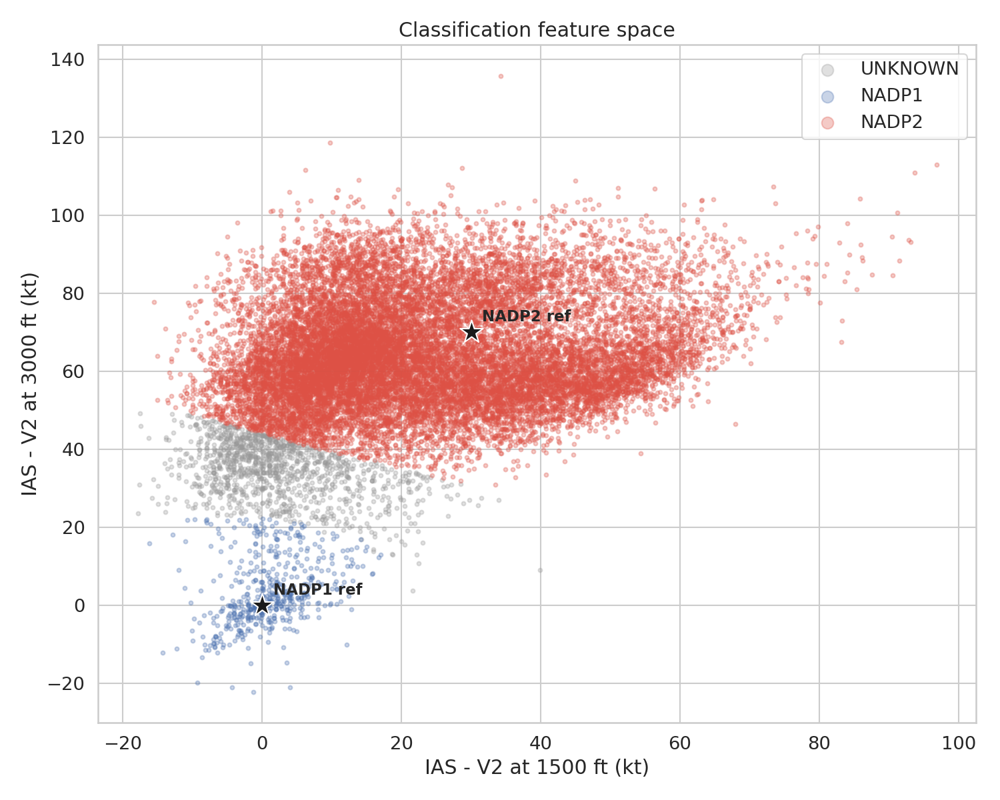
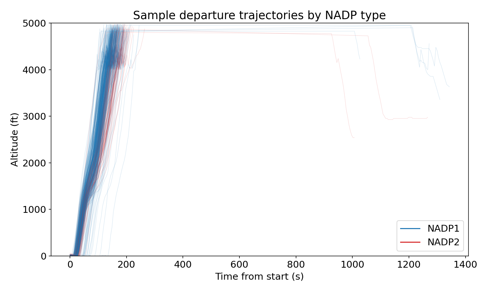
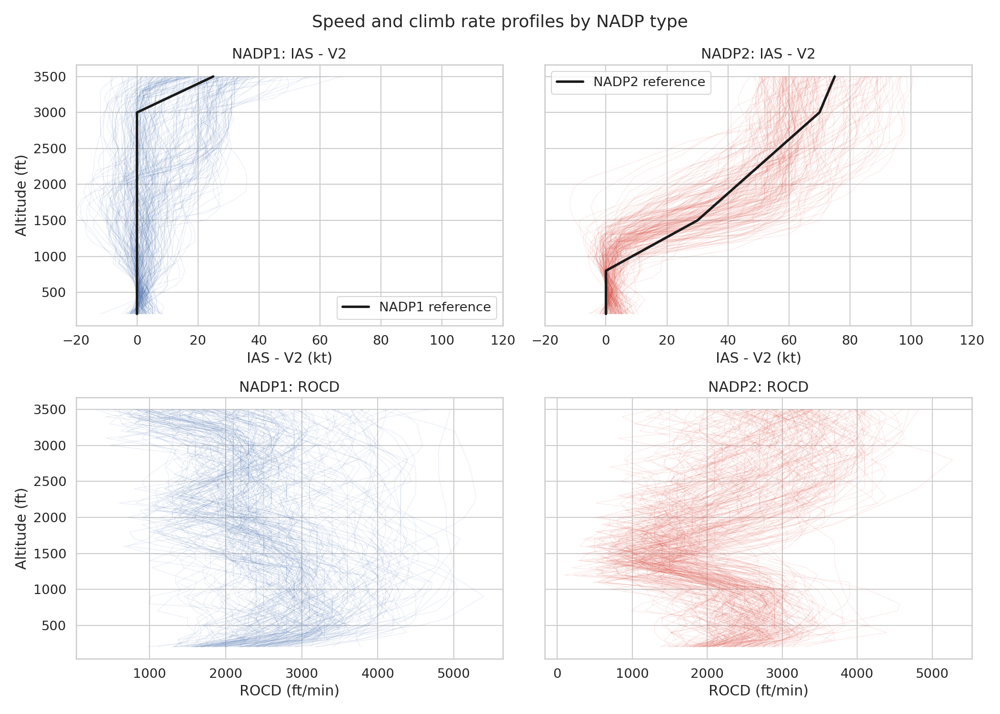
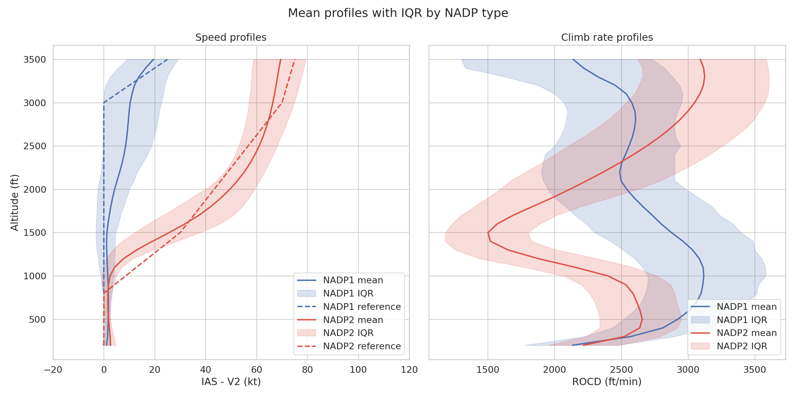
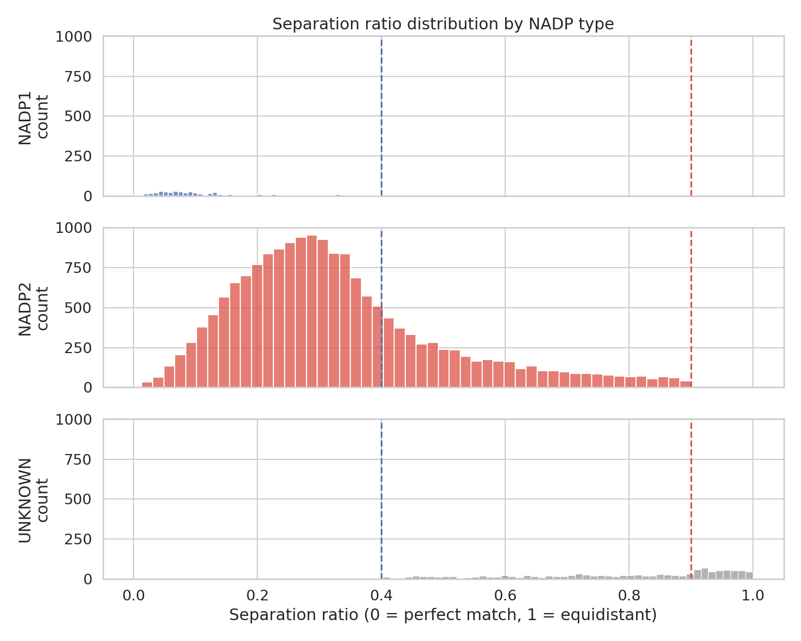
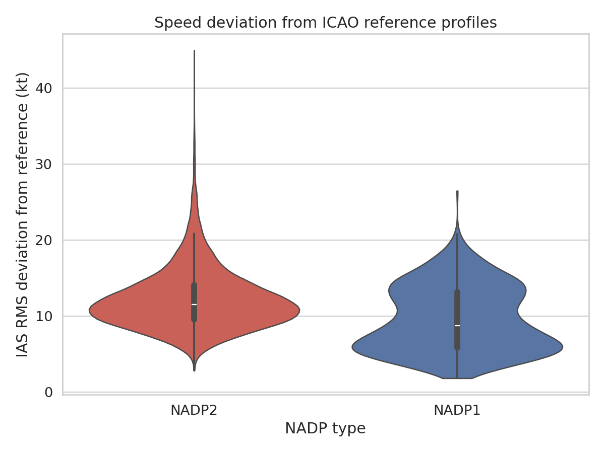
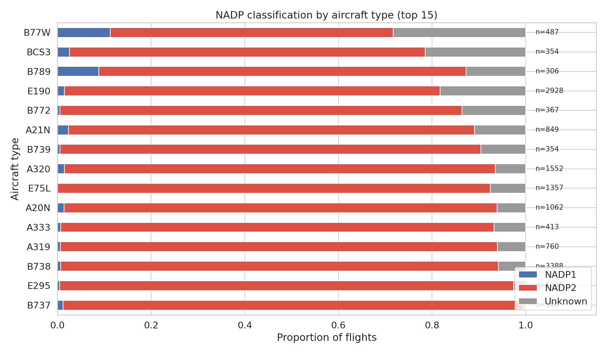
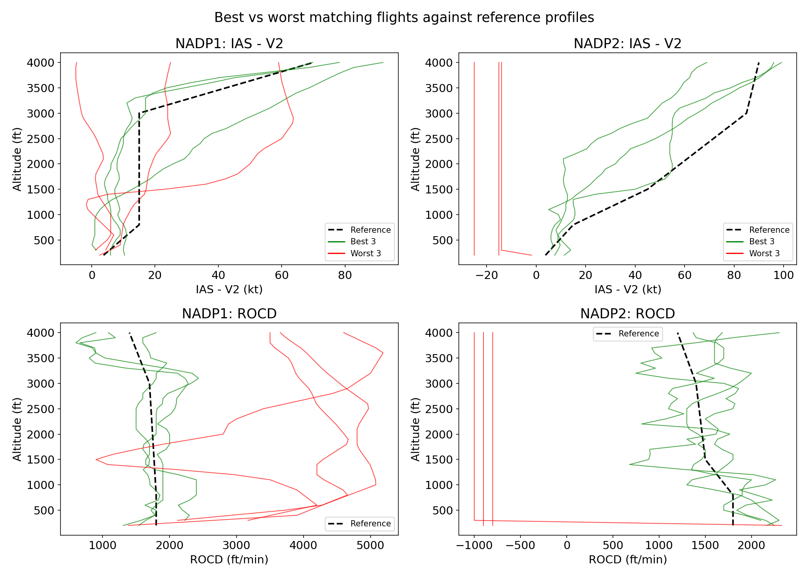

# NOMOS — NADP Profile Identification from Enhanced Surveillance Data

**Author:** Junzi Sun

## Objective

This repository identifies Noise Abatement Departure Procedure (NADP) profiles — NADP1 versus NADP2 — from aircraft departure trajectories at Amsterdam Schiphol Airport (EHAM). Each flight is classified by matching its speed profile against ICAO standard reference curves, and a delta score quantifies how much it deviates from the matched standard.

The system uses VEMMIS enhanced surveillance data, which provides direct indicated airspeed (IAS), rate of climb/descent (ROCD), and other Mode S parameters from the ground roll onward. This allows classification based on speed behavior rather than altitude shape alone.

## Background

NADP1 and NADP2 are two ICAO-defined departure climb procedures designed to reduce noise exposure at different distances from the runway:

- **NADP1 (close-in noise abatement):** The aircraft maintains takeoff configuration and a constant speed (approximately V2 + 10–20 kt) until 3000 ft, then accelerates and retracts flaps. This produces a steeper, slower climb that reduces noise close to the airport.

- **NADP2 (distant noise abatement):** The aircraft begins accelerating and retracting flaps from 800 ft onward. This produces a shallower, faster climb that reduces noise farther from the airport.

Both procedures are identical below 800 ft. The key discriminator is the speed profile between 800 and 3000 ft: NADP1 keeps constant speed while NADP2 accelerates progressively.


Schiphol recommends NADP2 for most departures. Literature suggests approximately 80% of departures follow NADP2, which is consistent with our findings.

## Data

The input data is VEMMIS enhanced surveillance (Mode S EHS) CSV files, one per day. Each row is a surveillance point with flight tracking information and downlinked aircraft parameters:

| Column | Description |
|--------|-------------|
| `FLIGHT_ID` | Unique flight identifier |
| `ICAO_ACTYPE` | Aircraft type code (e.g., B738, A320) |
| `ALT` | QNH-corrected altitude (ft) |
| `EHS_IAS` | Indicated airspeed from Mode S EHS (kt) |
| `EHS_ROCD` | Rate of climb/descent from Mode S EHS (ft/min) |
| `actual_time` | Timestamp |

Data files should be placed in `data/vemmis_202503/` with the naming pattern `vemmis_YYYYMMDD.csv`.

## Method

### V2 extraction

V2 (takeoff safety speed) varies per flight depending on aircraft weight, flap setting, and temperature. We extract a V2 proxy for each flight as the minimum IAS observed in the 200–800 ft altitude band. This captures the stabilized initial climb speed after the pitch-up transient following rotation, providing a clean baseline for computing speed deltas.

### Why speed only — no climb rate

The classification uses only indicated airspeed (IAS) and ignores rate of climb/descent (ROCD) entirely. There are several reasons for this:

1. **NADP is defined by speed behavior.** The ICAO procedures specify when to accelerate and retract flaps — at 800 ft for NADP2, at 3000 ft for NADP1. The defining characteristic is the speed profile shape, not the climb rate. ROCD differences between NADP1 and NADP2 are a secondary consequence of the speed and configuration decisions.

2. **IAS is a direct measurement; ROCD is derived and noisy.** Mode S EHS provides IAS as a directly downlinked parameter from the aircraft's air data computer. ROCD, however, is derived from barometric altitude differences over short time intervals, making it inherently noisy with oscillations of 500–1500 ft/min around the mean. This noise overwhelms the ~500 ft/min systematic difference between procedures.

3. **ROCD varies strongly with aircraft type and weight.** A heavy B777 and a light E190 may both follow NADP2 but have very different climb rates due to thrust-to-weight ratio differences. IAS relative to V2 normalizes out most of this variation — both aircraft types show the same acceleration pattern relative to their respective V2 speeds.

4. **Empirical validation.** Including ROCD in the classification distance metric caused noise to dominate the signal, producing unreliable results (e.g., inverting the expected NADP1/NADP2 ratio). Removing ROCD and classifying on IAS alone yielded results consistent with literature and Schiphol's known ~80% NADP2 adoption rate.

ROCD profiles are still computed and included in visualizations for comparison, as they reveal interesting aerodynamic signatures — notably the characteristic ROCD dip at 1000–1500 ft in NADP2 flights where the aircraft trades climb rate for speed during flap retraction.

### Classification

For each flight, we extract speed features at three NADP-critical altitudes:

| Feature | Description |
|---------|-------------|
| `delta_ias_800` | IAS minus V2 at 800 ft |
| `delta_ias_1500` | IAS minus V2 at 1500 ft |
| `delta_ias_3000` | IAS minus V2 at 3000 ft |

These are compared to ICAO reference feature vectors using weighted Euclidean distance:

- **NADP1 reference:** `[0, 0, 0]` — no acceleration until 3000 ft
- **NADP2 reference:** `[0, 30, 70]` — progressive acceleration from 800 ft

A flight is classified only if the two distances are sufficiently different. The separation ratio (closer distance / farther distance) must be below 0.6; otherwise the flight is marked as **unknown**. This prevents forced classification of ambiguous profiles.



### Delta score

After classification, each flight's full speed profile (IAS minus V2 at every 100 ft from 200 to 3500 ft) is compared to the matched ICAO reference curve. The delta score is the RMS residual normalized by 30 kt:

```
delta_score = RMS(flight_ias - reference_ias) / 30
```

A delta score of 0 means perfect conformance; higher values indicate greater deviation from the standard procedure.

## Pipeline

The analysis runs as three sequential scripts:

| Script | Input | Output | Description |
|--------|-------|--------|-------------|
| `1_ingest_vemmis.py` | `data/vemmis_202503/*.csv` | `data/vemmis_departures.parquet` | Filter EHAM departures, extract climb segments below 5000 ft within 500 s of departure |
| `2_extract_features.py` | `data/vemmis_departures.parquet` | `data/nadp_features.parquet` | Extract V2, milestone features, and altitude-indexed speed/ROCD curves per flight |
| `3_classify_nadp.py` | `data/nadp_features.parquet` | `data/nadp_results.csv` + `plots/` | Classify flights, compute delta scores, generate visualizations |

Run the pipeline:

```bash
uv run python 1_ingest_vemmis.py
uv run python 2_extract_features.py
uv run python 3_classify_nadp.py
```

## Results

Analysis of 19,250 EHAM departures in March 2025:

| Category | Flights | Percentage |
|----------|---------|------------|
| NADP1 | 752 | 3.9% |
| NADP2 | 16,031 | 83.3% |
| Unknown | 2,467 | 12.8% |

Among classified flights, **95.5% follow NADP2**, consistent with Schiphol's recommendation and literature values.

### Departure trajectories

NADP1 flights show steeper initial climbs, while NADP2 flights exhibit a more gradual, consistent climb profile:



### Speed and climb rate profiles

The top row shows IAS minus V2 as a function of altitude, with the ICAO reference curves overlaid. NADP1 flights maintain nearly constant speed through 3000 ft, while NADP2 flights accelerate progressively from 800 ft. The bottom row shows the corresponding ROCD profiles — NADP2 exhibits a characteristic dip around 1000–1500 ft where the aircraft trades climb rate for speed during flap retraction:



### Mean profiles

The mean speed and ROCD profiles with interquartile range show clear separation between the two procedures and good alignment with the ICAO reference curves:



### Separation ratio

The histogram of separation ratios shows that most classified flights have ratios well below the 0.6 threshold, indicating confident classification. Flights above the threshold are marked as unknown:



### Delta score distribution

The violin plot shows the distribution of IAS RMS deviation from the reference profiles. NADP1 flights tend to match their reference more closely (median ~8 kt) than NADP2 flights (median ~11 kt):



### Aircraft type breakdown

NADP classification varies by aircraft type. Wide-body aircraft (B77W, B789) show a higher proportion of NADP1 departures, while narrowbodies (B738, E295, B737) are almost entirely NADP2:



### Best and worst matches

Comparison of the three best-matching and three worst-matching flights against the reference profiles, for both IAS and ROCD:



## Output

The main output is `data/nadp_results.csv` with one row per flight:

| Column | Description |
|--------|-------------|
| `flight_id` | Unique flight identifier |
| `icao_actype` | Aircraft type code |
| `v2` | Extracted V2 proxy (kt) |
| `nadp_type` | Classification: `nadp1`, `nadp2`, or `unknown` |
| `delta_score` | Normalized RMS deviation from reference (0 = perfect match) |
| `delta_ias_rms` | Raw IAS RMS deviation (kt) |
| `delta_ias_800` | IAS minus V2 at 800 ft (kt) |
| `delta_ias_1500` | IAS minus V2 at 1500 ft (kt) |
| `delta_ias_3000` | IAS minus V2 at 3000 ft (kt) |
| `mean_rocd_800_1500` | Mean ROCD in 800–1500 ft band (ft/min) |
| `mean_rocd_1500_3000` | Mean ROCD in 1500–3000 ft band (ft/min) |

## Limitations

- **Altitude data:** The QNH-corrected ALT column has a discontinuity around 4000 ft due to the QNH-to-QNE barometric transition. Analysis is capped at 3500 ft to avoid this artifact.
- **V2 proxy:** The minimum IAS in the 200–800 ft band approximates V2 but may not exactly match the true V2 computed from aircraft performance tables.
- **Unknown flights:** About 13% of flights cannot be confidently classified. These may follow modified procedures, experience unusual wind conditions, or have noisy speed data.
- **ROCD noise:** Mode S ROCD values are inherently noisy (derived from barometric altitude differences). Classification uses IAS only; ROCD is reported for reference.
- **Single airport:** Reference profiles and thresholds are calibrated for Schiphol. Applying to other airports may require adjustment.
