# Classifying Noise Abatement Departure Procedures From Mode S Data

Junzi Sun

## 1. Introduction

Aircraft departing from airports near residential areas follow noise abatement departure procedures (NADPs) to reduce noise exposure on the ground. ICAO defines two standard procedures, NADP1 and NADP2, which differ in how the aircraft manages speed and configuration during the initial climb between 800 and 3000 ft.

In NADP1 (close-in noise reduction), the aircraft holds takeoff configuration and maintains a near-constant speed (about V2 + 10 to 20 kt) all the way to 3000 ft before accelerating and retracting flaps. The aircraft stays in a high-drag, high-lift configuration longer, which produces a steeper climb gradient. This concentrates the noise footprint closer to the airport but reduces it quickly with distance.

In NADP2 (distant noise reduction), the aircraft begins accelerating and retracting flaps earlier, from around 800 ft. The earlier cleanup reduces drag, so the aircraft gains speed faster but climbs less steeply. This spreads the noise footprint farther from the airport but at lower intensity per point on the ground.

Below 800 ft, both procedures are identical: the aircraft climbs at V2 + 10 to 20 kt in takeoff configuration. Above 3000 ft, both converge to the same clean configuration and accelerated speed. The difference is entirely in the 800 to 3000 ft band, and it shows up most clearly in the speed profile: NADP1 stays flat, NADP2 ramps up.

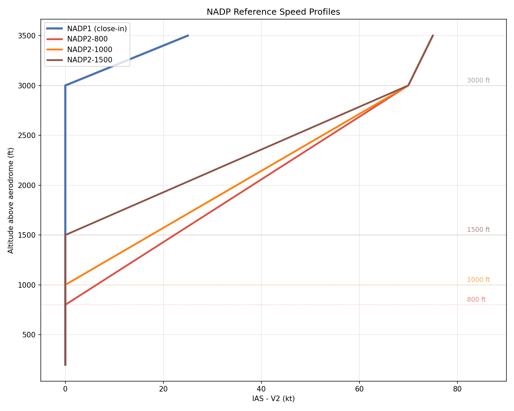

The NADP procedures are defined in ICAO Doc 8168 (PANS-OPS), Volume I, Part I, Section 7, Chapter 3 (ICAO, 2018). ICAO Circular 317 (ICAO, 2010) provides further analysis of the four NADP variants and their effects on noise and emissions.

The choice of procedure is typically made at the airline or airport level. Schiphol officially recommends NADP2 for all jet departures (LVNL, EHAM AD 2.21), formalized by a Dutch State Decree in 2014 (Staatscourant, 2014). The rationale combines noise reduction for communities farther from the runways, fuel savings (approximately 20 to 60 kg per departure), and a smaller overall noise exposure footprint (EASA, 2022). Schiphol and aviation authorities report approximately 80% NADP2 adoption (EASA, 2022), though this figure appears to derive from operator declarations rather than from independent trajectory classification studies. Simons et al. (2022) attributed a measured noise decrease at Schiphol starting in 2014 to the NADP2 implementation.

Published work on identifying NADP procedures from observed flight data is sparse. Most approaches work from altitude and ground track data, inferring the procedure from the climb gradient or lateral path. Bhanpato et al. (2021) used ADS-B altitude and ground speed data to cluster departure trajectories at San Francisco and compare cluster centroids against NADP reference profiles. Gagliardi et al. (2017) used ADS-B data at Pisa Airport to verify compliance with the NADP1 procedure by checking vertical and horizontal displacement at specific gates. Pretto et al. (2024) reconstructed departure procedure parameters (thrust, weight, procedure type) from ADS-B data at Zurich by fitting simulated profiles to observed trajectories for noise analysis. These approaches all rely on altitude and ground speed, which are indirect: the climb gradient depends on aircraft weight, thrust setting, and wind, not just the procedure. 

The approach in this research instead uses Mode S Enhanced Surveillance (EHS) data, which gives us the indicated airspeed (IAS) directly from the aircraft's air data computer. Since NADP procedures are defined by when the aircraft accelerates, classifying on speed is more direct than classifying on altitude shape.

Our results show 97.5% NADP2 adoption among classified flights. The higher proportion compared to the reported 80% is probably a combination of the longer study period (six months vs. typical snapshots of days or weeks), the fact that speed-based classification resolves flights that altitude-based methods would leave ambiguous, and possible growth in NADP2 adoption over time.

## 2. Data

We use VEMMIS enhanced surveillance data from Amsterdam Schiphol Airport, covering March through August 2025 (184 days). VEMMIS is the surveillance data system operated by LVNL (Air Traffic Control the Netherlands) that records Mode S Enhanced Surveillance (EHS) parameters. Unlike standard ADS-B, which provides ground speed and barometric altitude, Mode S EHS downlinks parameters directly from the aircraft's flight management system, including indicated airspeed (IAS), Mach number, true airspeed (TAS), magnetic heading, and barometric rate of climb/descent (ROCD).

The input consists of daily CSV files, one per day, with each row representing a single surveillance point. The relevant columns are:

| Column | Description |
|--------|-------------|
| `FLIGHT_ID` | Unique flight identifier |
| `CALLSIGN` | Flight callsign (e.g., KLM1234) |
| `ICAO_ACTYPE` | Aircraft type code (e.g., B738, A320) |
| `ALT` | QNH-corrected altitude (ft) |
| `EHS_IAS` | Indicated airspeed from Mode S EHS (kt) |
| `EHS_ROCD` | Rate of climb/descent from Mode S EHS (ft/min) |
| `actual_time` | Timestamp |
| `lat`, `lon` | Position |

The key advantage of this data for NADP classification is the IAS field. Conventional radar or ADS-B data provides ground speed, which is affected by wind. IAS comes from the aircraft's pitot-static system and directly reflects the aerodynamic state of the aircraft, which is what the NADP procedures actually prescribe.

Several parameters that are relevant to departure performance are not publicly observable and are absent from the data: takeoff weight, flap setting, engine thrust/throttle position, and the specific departure procedure selected by the crew. These are only available to the airline and the flight crew. This means we cannot directly determine the intended procedure or normalize for weight. Our classification method is designed around this constraint: by working with IAS relative to an estimated V2, we can infer the procedure from observable speed behavior without needing the unavailable parameters.

We filter the data to EHAM departures only, keep the first 500 seconds of each flight's climb, and retain only flights that reach 5000 ft within that window and have at least 10 surveillance points below 5000 ft. The feature extraction step further requires each flight to reach at least 3000 ft. After these filters, the dataset contains 127,237 flights across 131 aircraft types and 615 airline callsign prefixes.

## 3. Method

### 3.1 V2 extraction

V2 (takeoff safety speed) is different for every flight because it depends on weight, flap setting, and temperature. We approximate V2 as the minimum IAS in the 200 to 800 ft altitude band. This is the stabilized initial climb speed after the pitch-up transient that follows rotation, and it gives us a consistent baseline for computing speed deltas across flights. Flights with V2 outside 80 to 250 kt are dropped as invalid.

### 3.2 Why speed only, not climb rate

We classify on indicated airspeed alone and ignore ROCD entirely, for three reasons.

First, NADP procedures are defined by speed behavior: when to accelerate and when to retract flaps (800 ft for NADP2, 3000 ft for NADP1). Climb rate differences between the two procedures are a secondary consequence of these speed and configuration choices, not the defining feature.

Second, IAS comes directly from the aircraft's air data computer via Mode S downlink, while ROCD is derived from barometric altitude differences over short time intervals, making it noisy. Typical oscillations are 500 to 1500 ft/min around the mean, which swamps the ~500 ft/min systematic difference between procedures.

Third, ROCD varies a lot with aircraft type and weight. A heavy B777 and a light E190 can both follow NADP2 but climb at very different rates. IAS relative to V2 normalizes most of this out, because both types show the same acceleration pattern relative to their own V2.

We confirmed this empirically: including ROCD in the classification metric produced inverted NADP1/NADP2 ratios. Classifying on IAS alone gave results consistent with expected Schiphol adoption rates.

ROCD is still computed and shown in the plots for comparison.

### 3.3 Reference profiles

Each reference profile is a piecewise-linear function of altitude, defining the expected speed excess above V2 (i.e., $\Delta\text{IAS} = \text{IAS} - V_2$) at every altitude. These are sampled onto a regular grid at 100 ft intervals from 200 to 3500 ft ($N = 34$ altitude points):

| Profile | Breakpoints (altitude, $\Delta$IAS) | Description |
|---------|--------------------------------------|-------------|
| NADP1 | (0, 0), (800, 0), (3000, 0), (3500, 25) | Holds V2 through 3000 ft, then accelerates |
| NADP2 | (0, 0), (800, 0), (3000, 70), (3500, 75) | Linear acceleration from 800 ft |

Between breakpoints, values are linearly interpolated. The grid is capped at 3500 ft to avoid the QNH-to-QNE barometric altitude discontinuity around 4000 ft.

The figure below shows 200 sample flight profiles per type. Top row: IAS minus V2 versus altitude, with the reference curves in black. Bottom row: the corresponding ROCD profiles. The speed separation between NADP1 and NADP2 is clear in the top row. In the ROCD row, the scatter within each group is much larger than the difference between groups. The NADP2 ROCD dip around 1000 to 1500 ft is where the aircraft trades climb rate for speed during flap retraction:

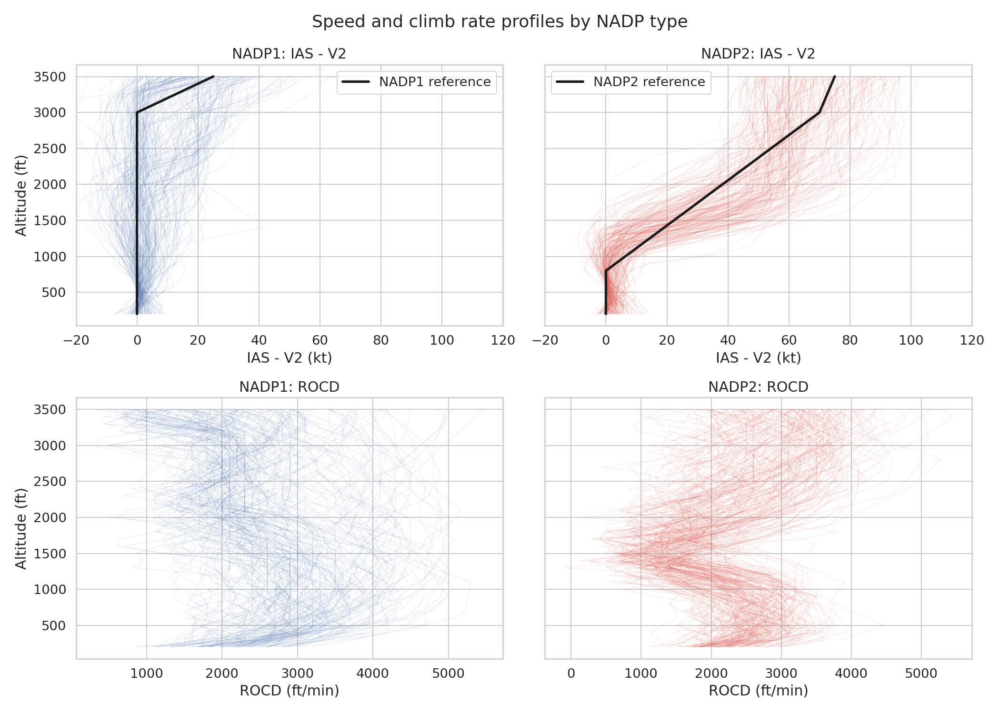

### 3.4 Classification (2-profile)

For each flight, we compute the RMS distance between its observed speed profile and each reference profile. Let $\mathbf{f} = (f_1, \ldots, f_N)$ be the flight's $\Delta\text{IAS}$ values at the altitude grid points where data is available, and let $\mathbf{r}^{(k)}$ be the corresponding reference values for profile $k$. The distance to reference $k$ is:

$$d_k = \sqrt{ \frac{1}{n} \sum_{i \in M} \left( f_i - r^{(k)}_i \right)^2 }$$

where $M$ is the set of altitude indices with valid (non-NaN) data and $n = |M|$. Flights with fewer than 5 valid points are marked as unknown.

The flight is assigned to the closest reference, but only if the match is unambiguous enough. We define the separation ratio:

$$\rho = \frac{\min(d_1, d_2)}{\max(d_1, d_2)}$$

When $\rho$ is close to 0, one reference is clearly better; when $\rho$ is close to 1, the flight is equidistant between both references. A flight is classified only when $\rho < \tau$, where $\tau = 0.6$ is the separation threshold. Above this, the flight is labeled "unknown."

The classification rule:

$$\text{type} = \begin{cases} \text{NADP1} & \text{if } d_1 < d_2 \text{ and } \rho < 0.6 \\ \text{NADP2} & \text{if } d_2 < d_1 \text{ and } \rho < 0.6 \\ \text{unknown} & \text{otherwise} \end{cases}$$

The feature space projection below shows the result of this classification. Each point is a flight plotted by its $\Delta\text{IAS}$ at 1500 ft and 3000 ft. The two ICAO reference points are marked with stars. NADP1 flights cluster near the origin; NADP2 flights spread along the acceleration axis:

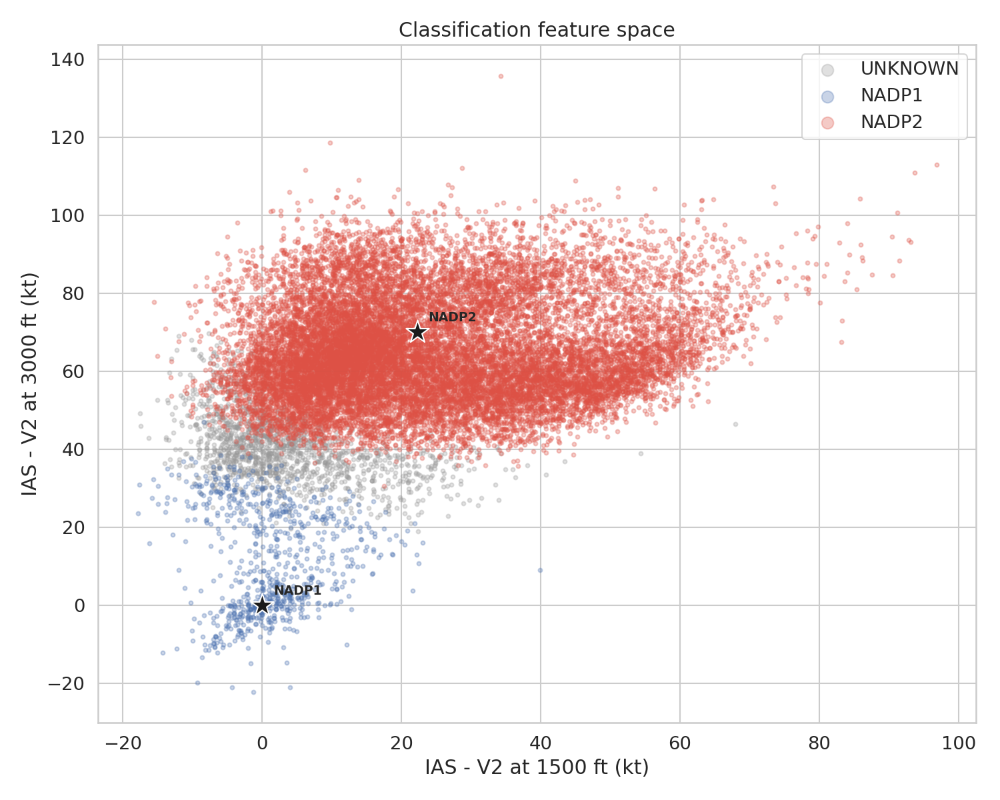

The separation ratio distribution confirms that most classified flights have ratios well below 0.6, meaning an unambiguous match. Flights above the threshold end up as "unknown":

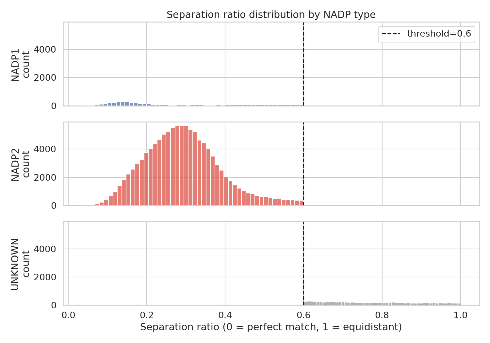

### 3.5 Delta score

After classification, the delta score quantifies how well a flight follows its matched reference. It is the same RMS distance $d_k$ to the assigned reference, normalized by 30 kt:

$$\delta = \frac{d_{\text{matched}}}{30}$$

A delta score of 0 means perfect adherence; a score of 1.0 means the flight deviates from its reference by 30 kt RMS on average. The normalization by 30 kt gives a readable scale relative to the ~70 kt total speed range of the NADP2 reference.

The mean delta score is 0.231 for NADP1 flights (6.9 kt RMS) and 0.398 for NADP2 flights (11.9 kt RMS). NADP2 flights have higher deltas partly because the single reference ramp is a simplification; real acceleration profiles vary in onset and slope.

The figure below shows three best-matching and three worst-matching flights per type, compared against the reference profiles:

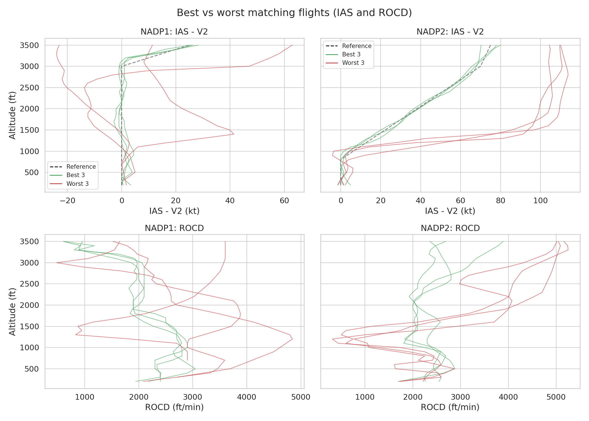

The worst NADP1 matches tend to be heavy wide-body variants whose speed profiles start accelerating before 3000 ft rather than holding flat. The worst NADP2 matches are typically lighter aircraft with low V2 values that accelerate well beyond the reference curve, reaching 80 to 100 kt above V2.

### 3.6 Extended classification (4-profile)

The higher NADP2 deltas suggest that a single NADP2 reference is too coarse. Real departures show a range of acceleration start altitudes. The extended classifier addresses this by introducing three NADP2 sub-types:

- NADP2-800: acceleration from 800 ft (steepest speed ramp, standard ICAO definition)
- NADP2-1000: acceleration from 1000 ft
- NADP2-1500: acceleration from 1500 ft (gentlest speed ramp)

All three variants reach approximately $V_2 + 70$ kt by 3000 ft. The NADP1 reference is the same as above. The three NADP2 references differ only in when acceleration begins:

| Profile | Breakpoints (altitude, $\Delta$IAS) |
|---------|--------------------------------------|
| NADP2-800 | (0, 0), (800, 0), (3000, 70), (3500, 75) |
| NADP2-1000 | (0, 0), (1000, 0), (3000, 70), (3500, 75) |
| NADP2-1500 | (0, 0), (1500, 0), (3000, 70), (3500, 75) |

The figure below shows sample flight traces against these four references. The three NADP2 variants differ in when acceleration begins but converge by 3000 ft:

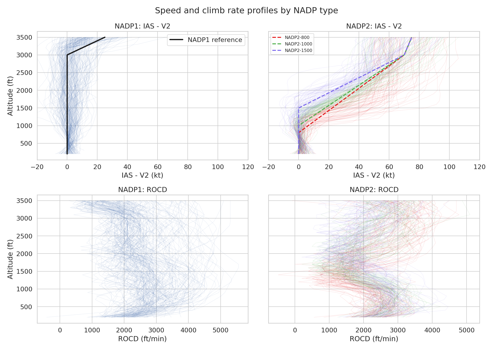

The RMS distance $d_k$ is computed to all four references. Classification proceeds in two steps:

**Step 1: NADP1 vs NADP2 family.** The best NADP2 distance is $d_{\text{NADP2}} = \min(d_{\text{800}}, d_{\text{1000}}, d_{\text{1500}})$. The separation ratio $\rho = \min(d_{\text{NADP1}}, d_{\text{NADP2}}) / \max(d_{\text{NADP1}}, d_{\text{NADP2}})$ determines whether the flight is classifiable. An asymmetric threshold is applied:

$$\text{type} = \begin{cases} \text{NADP1} & \text{if } d_{\text{NADP1}} < d_{\text{NADP2}} \text{ and } \rho < 0.4 \\ \text{best NADP2 sub-type} & \text{if } d_{\text{NADP2}} < d_{\text{NADP1}} \text{ and } \rho < 0.9 \\ \text{unknown} & \text{otherwise} \end{cases}$$

The stricter threshold for NADP1 ($\tau_1 = 0.4$) is because NADP1 flights cluster tightly; a flight must clearly match the flat-speed reference to be labeled NADP1. The relaxed NADP2 threshold ($\tau_2 = 0.9$) allows the three sub-types to absorb flights across the broad NADP2 spectrum.

**Step 2: NADP2 sub-type assignment.** If the flight is classified as NADP2, it is assigned to the sub-type with the smallest $d_k$: $\arg\min_{k \in \{800, 1000, 1500\}} d_k$.

The feature space projection shows how flights distribute across the four profiles. The sub-types form a continuum rather than discrete clusters:

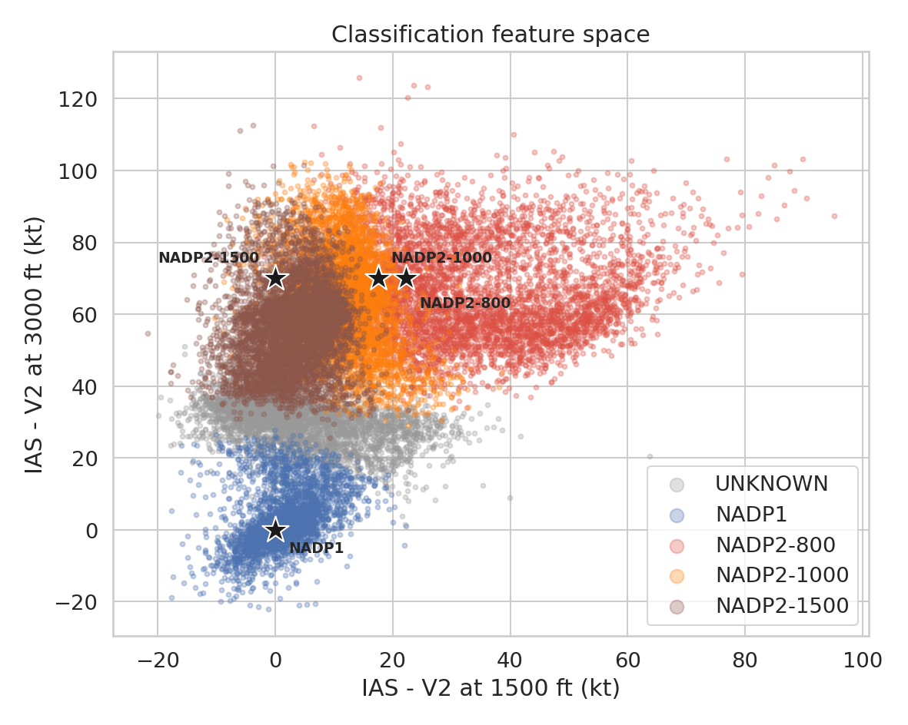

The separation ratio distributions show the effect of the asymmetric thresholds. NADP1 flights are tightly clustered below 0.4; NADP2 flights spread broadly but most fall below 0.9:

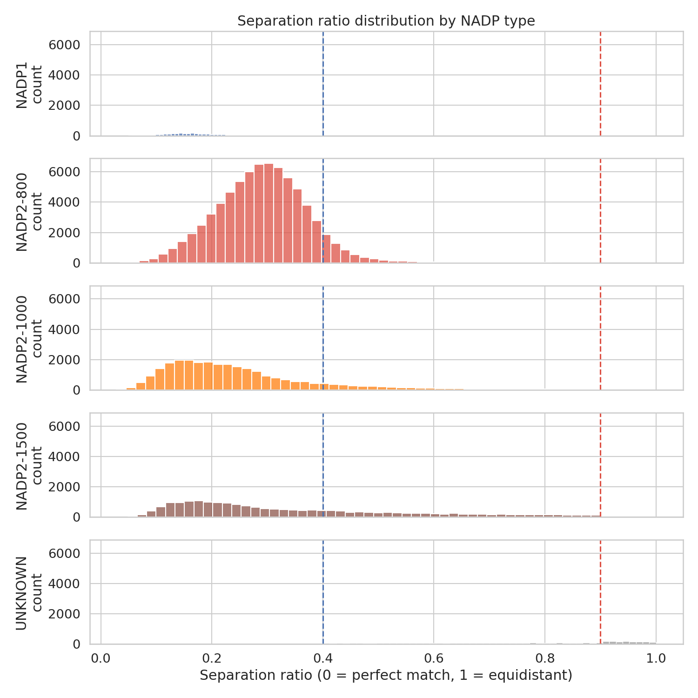

## 4. Results

### 4.1 Overall classification

127,237 EHAM departures from March to August 2025:

| Category | Flights | Percentage |
|----------|---------|------------|
| NADP1 | 3,093 | 2.4% |
| NADP2 | 120,459 | 94.7% |
| Unknown | 3,685 | 2.9% |

Among classified flights, 97.5% follow NADP2.

### 4.2 Departure trajectories

NADP1 flights climb more steeply. NADP2 flights have a more gradual, consistent altitude profile:

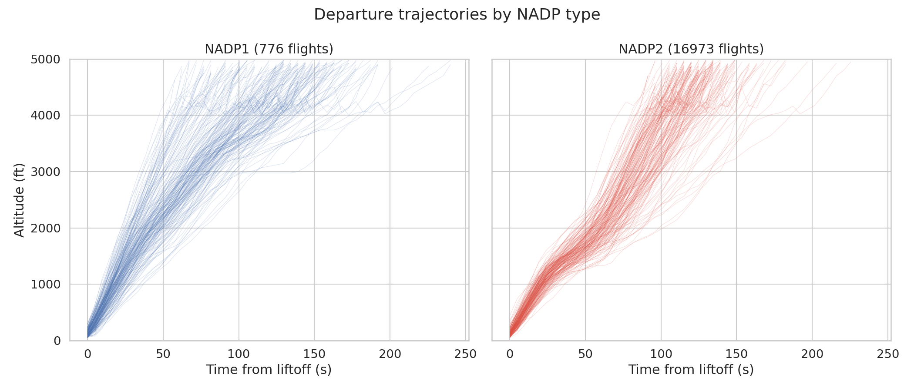

### 4.3 Mean profiles

Mean speed and ROCD with interquartile range. The two procedures separate cleanly, and the ICAO reference curves sit close to the observed means:

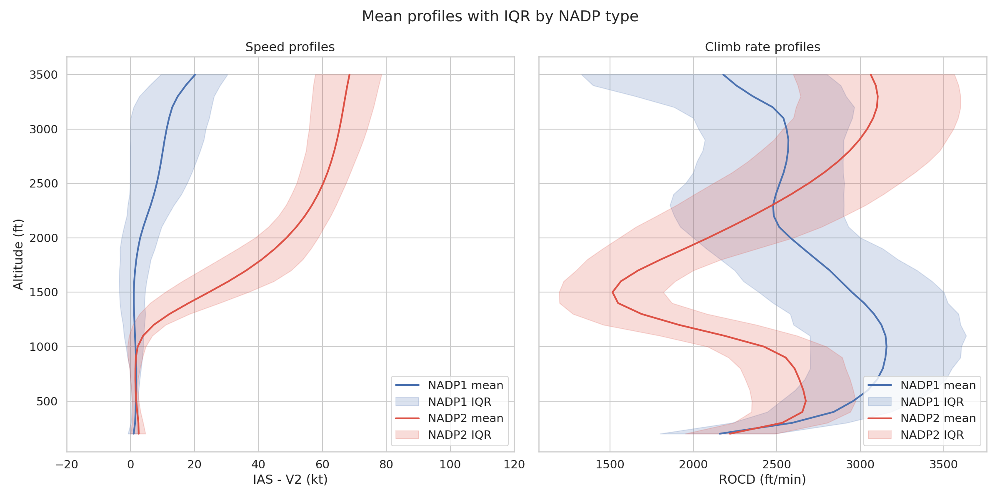

### 4.4 Threshold sensitivity

The separation ratio threshold controls how strict the classifier is. Lower thresholds push more flights into "unknown"; higher thresholds classify more aggressively at the risk of misassignment. We use 0.6 as a balance between coverage and confidence:

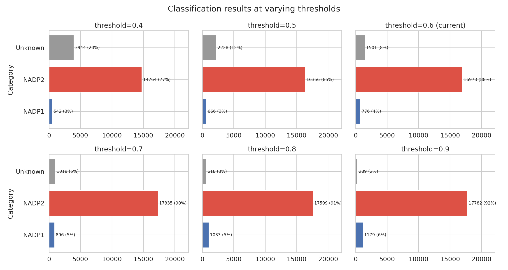

### 4.5 Aircraft type breakdown

Wide-bodies (B77W, B789) have more NADP1 departures. Narrowbodies (B738, E295, B737) are almost all NADP2. This probably reflects airline fleet-wide procedure assignments rather than aircraft capability differences:

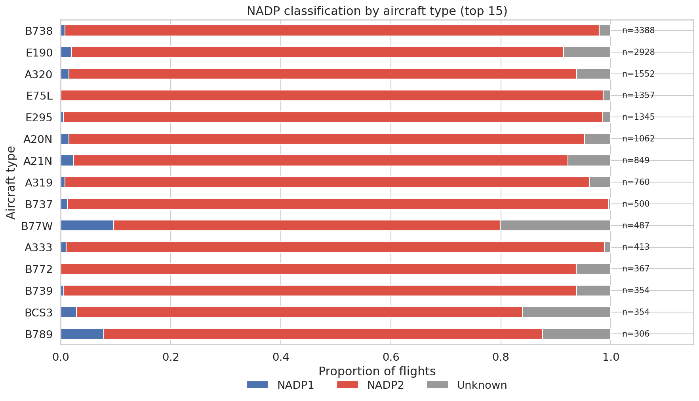

### 4.6 Airline breakdown

Most airlines at Schiphol are overwhelmingly NADP2. Air France (AFR) has the highest NADP1 proportion. Low-cost carriers (EZY, EJU, RYR) are almost exclusively NADP2. The NADP1 usage among long-haul carriers (QTR, DAL, UAE, UAL) probably comes from the wide-body effect seen in the aircraft type breakdown:

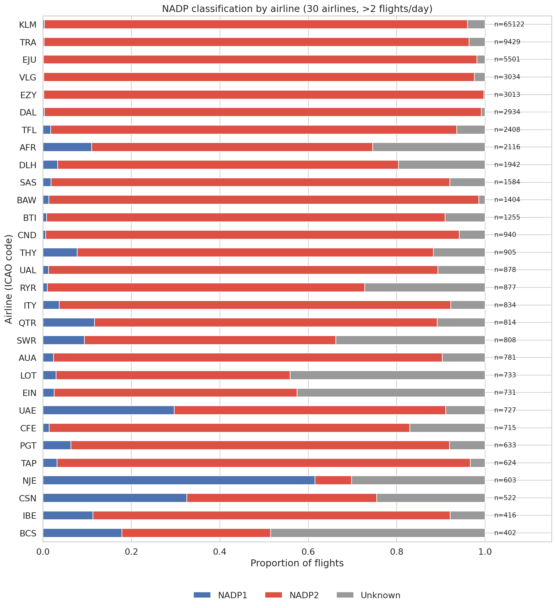

### 4.7 NADP2 sub-types

| Category | Flights | Percentage |
|----------|---------|------------|
| NADP1 | 3,093 | 2.4% |
| NADP2-800 | 73,338 | 57.6% |
| NADP2-1000 | 27,275 | 21.4% |
| NADP2-1500 | 19,846 | 15.6% |
| Unknown | 3,685 | 2.9% |

Most NADP2 departures (60.9%) match the standard 800 ft variant. The sub-type distribution is continuous rather than clustered, so these are best-fit assignments rather than discrete procedure categories.

Mean sub-type profiles with IQR bands, distance-indexed altitude profiles, and sub-type distribution:

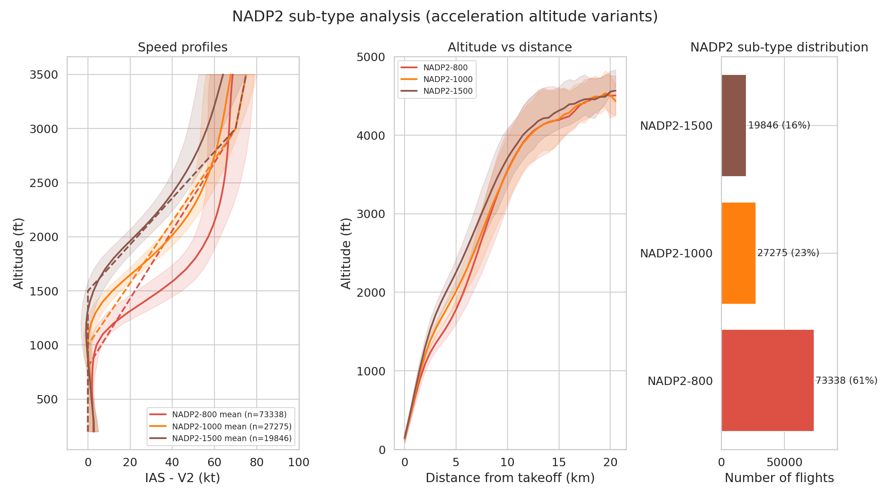

### 4.8 Sub-type breakdowns by aircraft type and airline

The sub-type distribution varies by aircraft type and airline, with some operators showing a preference for later acceleration:

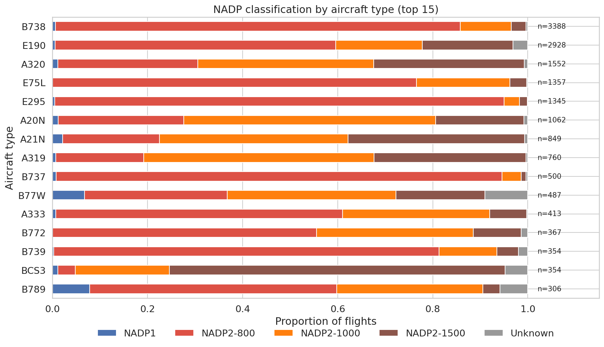

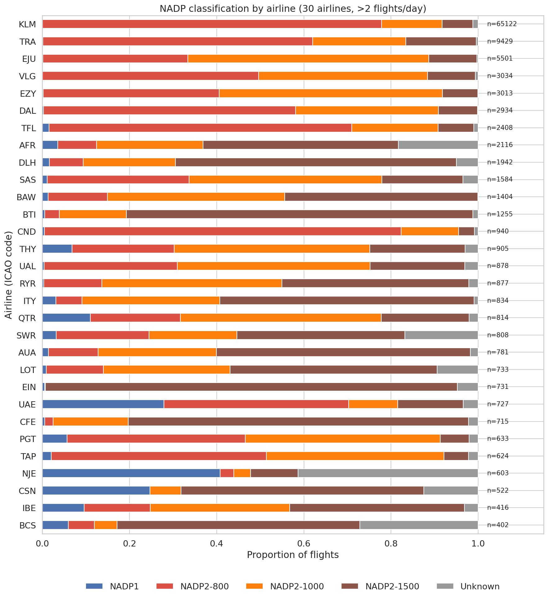

## 5. Limitations

The V2 proxy (minimum IAS in the 200 to 800 ft band) is an approximation. The actual V2 from aircraft performance tables depends on exact takeoff weight, flap setting, and temperature, none of which are available in the surveillance data. Our proxy captures the stabilized climb speed rather than V2 itself, but the difference is small and consistent across flights, so it works as a baseline for relative speed comparisons.

Mode S ROCD is derived from barometric altitude differences over short intervals, making it inherently noisy. Oscillations of 500 to 1500 ft/min around the mean are typical. We do not use ROCD for classification, but it is included in the output and plots because the qualitative patterns (e.g., the NADP2 climb rate dip during flap retraction) are still informative.

About 2.9% of flights can't be confidently classified in the 4-profile version. Some of these may follow modified or airline-specific departure procedures that don't match any of the four references. Others may have been affected by ATC constraints, wind shear, or speed restrictions that distort the normal speed profile. A smaller fraction simply have gaps or noise in the IAS data that prevent reliable curve matching.

The reference profiles are idealized piecewise-linear curves. Real departures show continuous variation in acceleration onset and slope, which is why the NADP2 sub-type boundaries are soft rather than discrete. The 30 kt normalization in the delta score is also a fixed choice; it works well for the Schiphol speed distributions but may not scale to airports with very different traffic mixes.

The separation ratio thresholds were tuned on Schiphol data. Other airports with different procedure adoption rates or aircraft mixes may need different thresholds. The same applies to the reference profile breakpoints, which assume standard ICAO procedure definitions.

## 6. Output data

The classifier produces a single CSV file (`data/nadp_results.csv`) with one row per classified flight. Each row contains the flight metadata, the assigned NADP type, and the quantitative scores used in the classification. The columns are:

| Column | Description |
|--------|-------------|
| `flight_id` | Unique flight identifier from the VEMMIS data |
| `typecode` | ICAO aircraft type designator (e.g. B738, A320) |
| `callsign` | ATC callsign (e.g. KLM1234) |
| `airline` | ICAO airline code, extracted as the first 3 characters of the callsign |
| `start` | Departure timestamp (time of the first airborne surveillance point) |
| `v2` | Estimated V2 proxy: minimum IAS in the 200 to 800 ft band (kt) |
| `nadp_type` | Assigned procedure: `nadp1`, `nadp2-800`, `nadp2-1000`, `nadp2-1500`, or `unknown` |
| `nadp_category` | Simplified label: `nadp1`, `nadp2`, or `unknown` |
| `delta_score` | Normalized RMS deviation from the matched reference ($d_{\text{matched}} / 30$) |
| `delta_ias_rms` | Raw RMS deviation from the matched reference (kt) |
| `delta_ias_800` | IAS minus V2 at 800 ft (kt) |
| `delta_ias_1500` | IAS minus V2 at 1500 ft (kt) |
| `delta_ias_3000` | IAS minus V2 at 3000 ft (kt) |
| `mean_rocd_800_1500` | Mean ROCD between 800 and 1500 ft (ft/min) |
| `mean_rocd_1500_3000` | Mean ROCD between 1500 and 3000 ft (ft/min) |

The `nadp_type` column gives the fine-grained 4-profile result. For users who only need NADP1 vs NADP2, the `nadp_category` column collapses the three NADP2 sub-types into a single `nadp2` label. The `delta_score` and `delta_ias_rms` columns can be used to filter out poor matches or to study how closely different airlines or aircraft types follow the standard profiles.

## 7. Conclusion

We classified more than 127,000 departures from Amsterdam Schiphol over six months (March to August 2025) into NADP1 and NADP2 using indicated airspeed from Mode S Enhanced Surveillance. The classifier works by comparing each flight's speed profile against piecewise-linear ICAO reference curves and assigning the closest match, with a separation ratio threshold to filter ambiguous cases.

Among classified flights, 97.5% follow NADP2, consistent with Schiphol's official recommendation. The remaining NADP1 flights concentrate in wide-body aircraft and specific airlines (Air France, Qatar Airways, Delta), suggesting the choice is made at the airline or fleet level rather than per flight.

Extending the classifier to four profiles (NADP1 plus three NADP2 sub-types with acceleration onset at 800, 1000, and 1500 ft) reveals that 60.9% of NADP2 flights match the standard 800 ft variant, while 22.6% start accelerating at 1000 ft and 16.5% at 1500 ft. These sub-types form a continuum rather than discrete clusters, but the breakdown varies across airlines and aircraft types, which may be useful for noise modeling or procedure compliance monitoring.

The approach has two practical advantages over altitude-based methods. First, IAS is directly prescribed by the NADP procedure definition, so the classification target matches what the procedures actually specify. Second, normalizing by V2 removes most of the variation due to aircraft type and weight, allowing a single set of reference curves to work across the full traffic mix.

The method and thresholds are calibrated for Schiphol and should be validated for other airports with Mode S data. Applying the method to other airports would require checking whether the reference profiles (especially NADP2 sub-types) and separation thresholds still produce reasonable results for a different traffic mix and procedure adoption pattern.

## References

Bhanpato, J., Puranik, T.G., & Mavris, D.N. (2021). Data-Driven Analysis of Departure Procedures for Aviation Noise Mitigation. *Engineering Proceedings*, 13(1), 2. DOI: 10.3390/engproc2021013002

EASA (2022). European Aviation Environmental Report, Aircraft Operations. Available at: https://www.easa.europa.eu/en/domains/environment/eaer/airports/airport-measures/aircraft-operations

Gagliardi, P., Fredianelli, L., Simonetti, D., & Licitra, G. (2017). ADS-B System as a Useful Tool for Testing and Redrawing Noise Management Strategies at Pisa Airport. *Acta Acustica united with Acustica*, 103(4), 543-551. DOI: 10.3813/AAA.919083

ICAO (2010). *Effects of PANS-OPS Noise Abatement Departure Procedures on Noise and Gaseous Emissions*, Cir 317-AT/136. International Civil Aviation Organization, Montreal.

ICAO (2018). *Procedures for Air Navigation Services: Aircraft Operations (PANS-OPS)*, Doc 8168, Volume I, 6th Edition. International Civil Aviation Organization, Montreal.

LVNL. Netherlands AIP, EHAM AD 2.21: Noise Abatement Procedures. Available at: https://eaip.lvnl.nl/web/eaip/default.html

Pretto, M., Dorbolò, L., Giannattasio, P., & Zanon, A. (2024). Aircraft operation reconstruction and airport noise prediction from high-resolution flight tracking data. *Transportation Research Part D*, 135, 104397. DOI: 10.1016/j.trd.2024.104397

Simons, D.G., Besnea, I., Mohammadloo, T.H., Melkert, J.A., & Snellen, M. (2022). Comparative assessment of measured and modelled aircraft noise around Amsterdam Airport Schiphol. *Transportation Research Part D*, 105, 103216. DOI: 10.1016/j.trd.2022.103216

Staatscourant (2014). Nr. 11802, Regeling van de Staatssecretaris van Infrastructuur en Milieu. Available at: https://zoek.officielebekendmakingen.nl/stcrt-2014-11802.html
